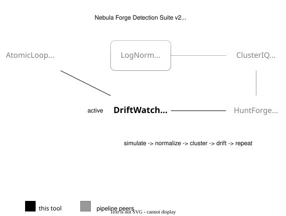
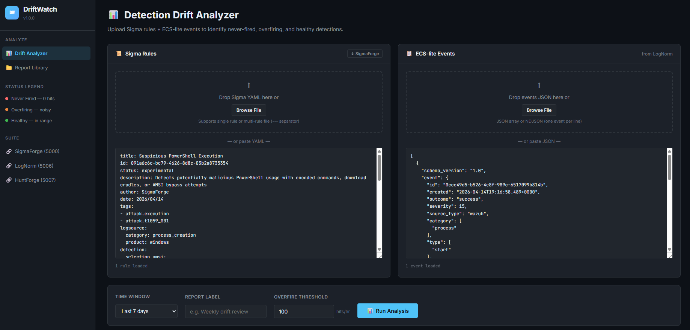
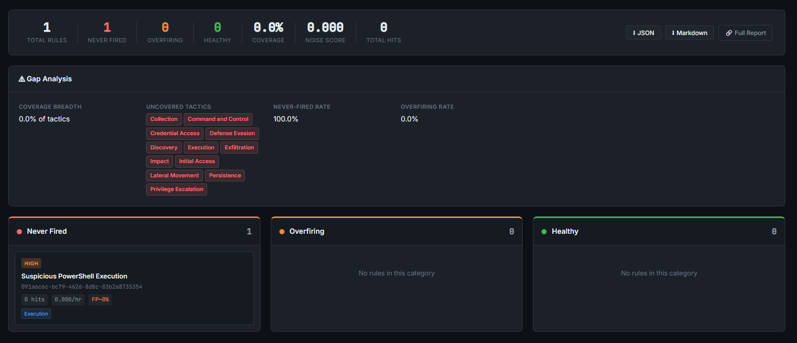

<div align="center">

# DriftWatch — Detection Drift Analyzer

Part of the **Nebula Forge** security tools suite.

DriftWatch identifies detection drift in your Sigma rule sets by correlating rules against normalized log events (ECS-lite). It classifies every rule as **never-fired**, **overfiring**, or **healthy**, and generates per-rule stats, gap analysis, and tuning suggestions.

     

 </div>

---

## Pipeline Position



> **purple-loop:** `AtomicLoop → LogNorm → ClusterIQ → HuntForge → DriftWatch → repeat`

---

## Screenshots

### Drift Dashboard




### Analysis Results — Rule Cards




---

## Features

- **Sigma rule parsing** — full field modifier support (contains, startswith, endswith, re, all, windash, base64, cidr), multi-document YAML files
- **Three-state classification** — never-fired (0 hits), overfiring (>threshold hits/hr), healthy (in range)
- **Per-rule statistics** — hit count, rate/hour, last seen, FP estimate, matched events (sample), hit timeline
- **Gap analysis** — uncovered MITRE tactics, never-fired %, overfiring %, high-FP rules
- **Tuning suggestions** — actionable advice per rule status
- **Report library** — persistent SQLite storage, search, pagination, export
- **Export** — JSON and Markdown formats
- **CLI** — offline analysis without the web UI
- **Integrations** — pull rules from SigmaForge (port 5000), accepts ECS-lite events from LogNorm (port 5006)

---

## Quick Start

```bash
cd DriftWatch
pip install -r requirements.txt
cp config.example.yaml config.yaml   # optional — defaults work out of the box
python app.py
```

Open [http://127.0.0.1:5008](http://127.0.0.1:5008).

---

## Usage

### Web UI

1. Paste or upload Sigma rules (YAML, single or multi-document with `---` separators).
2. Paste or upload ECS-lite events (JSON array or NDJSON).
3. Set the time window, report label, and overfire threshold.
4. Click **Run Analysis**.

Rule cards are clickable — each opens a detail modal with:
- **Overview** — hit count, rate/hr, FP estimate, description, tags
- **Matched Events** — raw event samples (up to 10)
- **Tuning Suggestions** — actionable recommendations

### CLI

```bash
# Analyze rules against events, print summary
python cli.py --rules rules.yml --events events.json

# Directory of rule files, custom window, save to Markdown
python cli.py --rules ./rules/ --events events.json --window 72 --output report.md

# Validate a single rule
python cli.py --validate --rule rule.yml --events events.json

# Print as JSON
python cli.py --rules rules.yml --events events.json --format json

# Skip saving to database
python cli.py --rules rules.yml --events events.json --no-save
```

---

## API Reference

| Method | Endpoint | Description |
|--------|----------|-------------|
| GET  | `/api/health` | Health check |
| POST | `/api/analyze` | Run drift analysis |
| POST | `/api/validate` | Validate a single rule |
| GET  | `/api/reports` | List saved reports (paginated) |
| GET  | `/api/report/<id>` | Get a single report |
| DELETE | `/api/report/<id>` | Delete a report |
| GET  | `/api/report/<id>/export` | Export report (JSON or Markdown) |
| GET  | `/api/integrations/sigmaforge/rules` | Fetch rules from SigmaForge |

### POST /api/analyze — JSON body

```json
{
  "rules_yaml":         "title: ...\n---\ntitle: ...",
  "events_json":        "[{...}, {...}]",
  "time_window_hours":  168,
  "label":              "Weekly drift review",
  "overfire_threshold": 100.0
}
```

Also accepts `multipart/form-data` with `rules_file` and `events_file` fields.

### Drift report structure

```json
{
  "id":                "uuid",
  "label":             "Weekly drift review",
  "time_window_hours": 168,
  "event_count":       4821,
  "analyzed_at":       "2025-01-01T12:00:00",
  "summary": {
    "total_rules":       25,
    "never_fired_count": 10,
    "overfiring_count":  3,
    "healthy_count":     12,
    "coverage_pct":      52.0,
    "noise_score":       0.12,
    "total_matches":     1024,
    "gap_analysis": {
      "uncovered_tactics":   ["collection", "exfiltration"],
      "never_fired_pct":     40.0,
      "overfiring_pct":      12.0,
      "coverage_breadth":    60.0,
      "low_confidence_rules": []
    }
  },
  "never_fired":  [ { "rule_id": "...", "title": "...", "hit_count": 0, ... } ],
  "overfiring":   [ ... ],
  "healthy":      [ ... ]
}
```

---

## Supported Sigma Modifiers

| Modifier | Description |
|----------|-------------|
| `contains` | Field contains value (case-insensitive substring) |
| `startswith` | Field starts with value |
| `endswith` | Field ends with value |
| `re` | Field matches regex |
| `all` | All values must match (AND instead of OR) |
| `windash` | Matches both `-` and `/` as flag prefixes |
| `base64` | Value is base64-encoded in event |
| `base64offset` | Handles base64 offset variants (0/1/2) |
| `utf16le` / `wide` | UTF-16LE encoding |
| `cidr` | Network CIDR range matching |
| Wildcards | `*` and `?` glob patterns |

Condition expressions: `and`, `or`, `not`, `all of <name>`, `N of <name>`, `all of them`, `1 of them`.

---

## ECS-lite Field Mappings

DriftWatch maps Sigma field names to ECS-lite dot-notation paths used by LogNorm:

| Sigma field | ECS-lite path |
|-------------|---------------|
| `CommandLine` | `process.command_line` |
| `Image` | `process.executable` |
| `EventID` | `event.code` |
| `DestinationIp` | `destination.ip` |
| `DestinationPort` | `destination.port` |
| `TargetObject` | `registry.path` |
| `ScriptBlockText` | `powershell.script_block_text` |

See `core/field_mappings.py` for the complete mapping table.

---

## Configuration

| Key | Default | Description |
|-----|---------|-------------|
| `host` | `127.0.0.1` | Bind address |
| `port` | `5008` | HTTP port |
| `db_path` | `./driftwatch.db` | SQLite database |
| `analysis.overfire_threshold` | `100.0` | hits/hr overfire cutoff |
| `analysis.default_window_hours` | `168` | Default time window |
| `analysis.max_events` | `100000` | Event input cap |
| `analysis.max_rules` | `500` | Rule input cap |
| `analysis.auto_save` | `true` | Save reports automatically |
| `integrations.sigmaforge_url` | `http://127.0.0.1:5000` | SigmaForge endpoint |
| `integrations.lognorm_url` | `http://127.0.0.1:5006` | LogNorm endpoint |

---

## Project Structure

```
DriftWatch/
├── app.py              # Flask web application and REST API
├── cli.py              # CLI — analyze / validate / export
├── core/
│   ├── analyzer.py     # DriftAnalyzer — rule evaluation and classification
│   ├── field_mappings.py  # Sigma → ECS-lite field name mappings
│   └── sigma_parser.py # Sigma YAML parser and condition evaluator
├── templates/
│   └── index.html      # Single-page web UI
├── driftwatch.db       # SQLite report store (auto-created)
├── config.yaml         # Optional config (copy from config.example.yaml)
└── rules/              # Baseline Sigma rule library for pipeline use
    └── baseline.yml    # Canonical rule set for purple-loop coverage validation
```

### rules/baseline.yml

`baseline.yml` is a multi-document Sigma YAML file used by the purple-loop pipeline as the reference rule set for detection coverage validation. Each document block defines one Sigma rule; blocks are separated by `---`.

**Techniques currently tracked:**

| Rule title | Technique |
|---|---|
| Child Process of WinRM Provider Host (wsmprovhost.exe) | T1021.006 |

**Adding a rule to baseline.yml:**

1. Append `---` after the last rule in the file.
2. Paste or write a valid Sigma rule block.
3. Run `python cli.py --rules rules/baseline.yml --events <events.json>` to confirm it parses without errors.

The file can also be passed directly to `POST /api/analyze` as the `rules_yaml` field body.

---

## Nebula Forge Integration

DriftWatch is registered in the Nebula Forge dashboard and serves as the **detection-validation step** in the purple-loop pipeline.

### purple-loop role

In the purple-loop pipeline (`pipelines/purple-loop/main.py`), DriftWatch validates whether a Sigma rule fired after AtomicLoop executes an atomic technique:

1. AtomicLoop runs the technique, captures ECS-lite events, and stores them internally under a `run_id`.
2. purple-loop POSTs `{"run_id": "<uuid>", "sigma_rule": "<yaml>"}` to **AtomicLoop's** `/api/validate`, which proxies to DriftWatch.
3. If no `run_id` is available (fallback), purple-loop POSTs `rules_yaml` + `events_json` directly to **DriftWatch's** `/api/validate`.
4. DriftWatch returns `{"detection_fired": bool, "match_count": int, "gap_analysis": "..."}`.

The baseline rule set for this pipeline lives in `rules/baseline.yml`.

### Dashboard registration

Add to `nebula-dashboard/config.yaml`:

```yaml
tools:
  driftwatch:
    label:       "DriftWatch"
    url:         "http://127.0.0.1:5008"
    health_path: "/api/health"
    description: "Detection drift analyzer for Sigma rules"
    category:    "Detection"
```

---

## License

This project is licensed under the MIT License — see the [LICENSE](LICENSE) file for details.


<div align="center">

Built by [Rootless-Ghost](https://github.com/Rootless-Ghost) 

Part of the **Nebula Forge** security tools suite.
